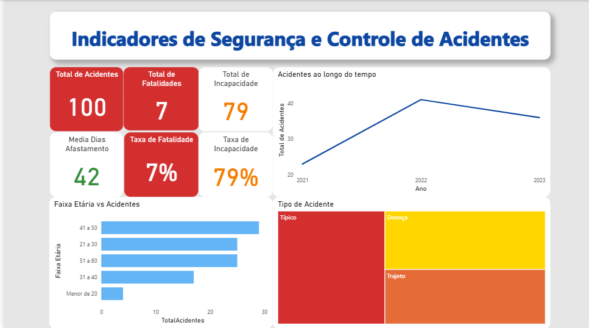

# 📊 Dashboard de Acidentes – Análise e Prevenção

## 📌 Sobre o Projeto
Este projeto apresenta um dashboard interativo em Power BI para análise de acidentes de trabalho, utilizando dados simulados.

O objetivo é demonstrar, de forma prática, como aplicar fórmulas DAX, visualizações dinâmicas e segmentações para gerar insights sobre segurança do trabalho e apoiar a tomada de decisões preventivas.

---

## 🎯 Objetivos
- Analisar a quantidade e tipos de acidentes.
- Calcular indicadores como taxa de fatalidade e taxa de incapacidade.
- Visualizar tendências ao longo do tempo.
- Disponibilizar informações por faixa etária.

---

## 🖼️ Visualização do Dashboard



---

## 🛠️ Ferramentas Utilizadas
- Power BI Desktop
- Base de dados simulada (.csv) – 100 funcionários, gerada em Python.
- Linguagem DAX para cálculos e medidas.

---

## 📂 Estrutura do Projeto

📦dashboard-acidentes

## Base de dados simulada
┣ 📜 cat_simulado_100func.csv 

## Arquivo do Power BI
┣ 📜 dashboard.pbix 

## Documentação
┗ 📜 README.md 


---

## 📊 Principais Indicadores Criados (DAX)

### Total de Acidentes
````DAX
TotalAcidentes =
CALCULATE(
    COUNTROWS('cat_simulado_100func'),
    'cat_simulado_100func'[Acidente] = "Sim"
)

````
### Total de Fatalidades
````DAX
TotalFatalidades =
CALCULATE(
    COUNTROWS('cat_simulado_100func'),
    'cat_simulado_100func'[Fatalidade] = 1
)
````
### Taxa de Fatalidade (%)
````DAX
TaxaFatalidade =
DIVIDE(
    [TotalFatalidades],
    [TotalAcidentes],
    0
)
````
### Total de Incapacidades
````DAX
TotalIncapacidades =
CALCULATE(
    COUNTROWS('cat_simulado_100func'),
    'cat_simulado_100func'[Incapacidade] = 1
)
````
### Taxa de Incapacidade (%)
````DAX
TaxaIncapacidade =
DIVIDE(
    [TotalIncapacidades],
    [TotalAcidentes],
    0
)
````
### Média de Dias de Afastamento
````DAX
MediaDiasAfastamento =
AVERAGE('cat_simulado_100func'[Dias_Afastamento])
````
### Faixa Etária (Coluna Calculada)
````DAX
FaixaEtaria =
SWITCH(
    TRUE(),
    'cat_simulado_100func'[Idade] < 25, "Menos de 25",
    'cat_simulado_100func'[Idade] <= 35, "25 a 35",
    'cat_simulado_100func'[Idade] <= 50, "36 a 50",
    "Acima de 50"
)
````
## 📈 Visuais Criados no Dashboard
- **Cartões** → Total de Acidentes, Fatalidades, Incapacidades, Taxas (%).
- **Gráfico de Linha** → Evolução de acidentes ao longo do tempo.
- **Gráfico de Barras** → Tipo de Acidente vs Quantidade.
- **Treemap** → Peso relativo de cada tipo de acidente.

---

## 🧪 Base de Dados Simulada
A base [cat_simulado_100func.csv](https://github.com/WaldeniseMoraes/dashboard-sst-acidentes/tree/main/dataset) foi criada via Python para simular cenários realistas, incluindo:
- Idade
- Tipo de acidente (Típico, Trajeto, Doença Ocupacional)
- Fatalidade (0/1)
- Incapacidade (0/1)
- Dias de afastamento

---

## 📌 Como Usar
1. Baixe o arquivo `dashboard_sst.pbix` e `cat_simulado_100func.csv`.
2. Abra o Power BI Desktop.
3. Importe o CSV.
4. Copie e cole as fórmulas DAX acima.
5. Personalize os visuais conforme necessário.

---

## 👩‍💻 Autora

**Waldenise de Oliveira Moraes**  
Engenheira de Produção, Engenheira de Segurança do Trabalho e Ambiental, Cientista de Dados e Inteligência Artificial.  

[](https://www.linkedin.com/in/waldenise-moraes/)
[](mailto:engwaldenise@outlook.com)

---

